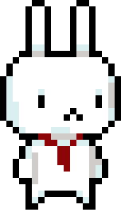
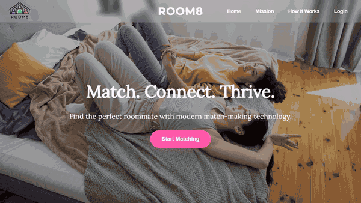
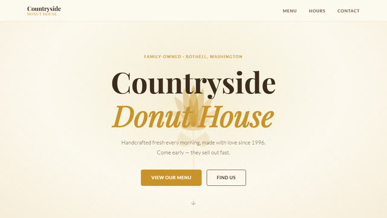
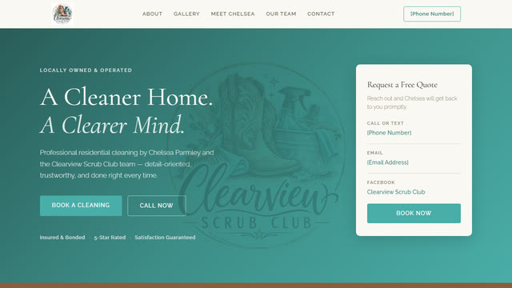
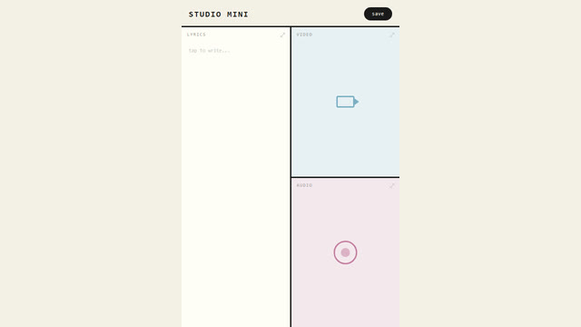

<a href="https://github.com/lilltill7">

</a>

<p align="center">

</p>

<p align="center">


</p>

---



I make fun projects that make life easier, more artistic, and more connected! I love hands-on projects that I can tinker with, and I can't help adding a cat somewhere if I can.

I'm in a self-designed major at Whitman, **Computational Media & Creative Technology** (computer science + economics + music), and I'm looking for internships in software, music tech, and creative tech.

<sub>☝️ that's my scarf bunny, drawn in Piskel for my game <a href="https://github.com/lilltill7/Trifecta">Trifecta</a></sub>

<br clear="right"/>

---

### 🎹 see it work

<p align="center">
<a href="https://github.com/lilltill7/artificial-artists">

</a>
<br/>
<sub><b>Artificial Artists, prototype 1:</b> MIDI from Ableton lights up a live visual keyboard. Eventually, my programmed backing band gets to be seen on stage too.</sub>
</p>

---

### 🌐 websites I've built

<table>
<tr>
<td width="50%" align="center">
<a href="https://github.com/lilltill7/room8-v1"></a>
<br/><sub><b>Room8</b>: my first attempt at a website! I designed and built the whole UI</sub>
</td>
<td width="50%" align="center">
<a href="https://countryside-donut-house.netlify.app"></a>
<br/><sub><b>Countryside Donut House</b>: built for a family-owned donut shop in Bothell, WA</sub>
</td>
</tr>
<tr>
<td width="50%" align="center">

<br/><sub><b>Clearview Scrub Club</b>: hired to build the site for a local house-cleaning business</sub>
</td>
<td width="50%" align="center">
<a href="https://github.com/lilltill7/Studio-Mini"></a>
<br/><sub><b>Studio Mini</b>: my own side project, with lyrics, video, and audio in one place</sub>
</td>
</tr>
</table>

---

### 🧶 things I'm tinkering with

**🎸 Music & creative tech**
| | |
|:--|:--|
| [TrackMate](https://github.com/lilltill7/trackmate) | My senior capstone: a beginner-friendly DAW with an AI music-theory coach that teaches you, and never makes the music for you. `prototyping 2026–27` |
| [Artificial Artists](https://github.com/lilltill7/artificial-artists) | A live show where my backing tracks get visual band members. `prototype 1 ✓` |
| [Studio Mini](https://github.com/lilltill7/Studio-Mini) → WholeNote | Lyrics, voice memos, and video takes for a song idea, all in one place. WholeNote adds chords. `growing` |

**🔧 Hands-on hardware**
| | |
|:--|:--|
| [Lecture Buddy](https://github.com/lilltill7/lecture-buddy) | A little ESP32-S3 desk buddy that records lectures and turns them into notes, with a pixel-art mascot on its screen. `in design` |
| [Simon Says](https://github.com/lilltill7/simon_says_arduino) | The memory game, rebuilt with an Arduino and real buttons and lights |
| [ORB Feature Matching](https://github.com/lilltill7/orb-feature-matching) | Teaching a computer to recognize the same object across different photos (OpenCV) |

**🤝 Bringing people together**
| | |
|:--|:--|
| [Blue & I](https://github.com/lilltill7/blue-and-i) | A Whitman-only app for finding friends to study, hike, or hit the gym with. Fewer screens, more hangouts. `idea stage` |
| [Room8](https://github.com/lilltill7/room8-v1) | Roommate-matching prototype. I designed and built the whole UI |

**🍳 Making life easier & 🎮 just for fun**
| | |
|:--|:--|
| [The Heather Plate](https://github.com/lilltill7/heather-plate) | Paste an Instagram, TikTok, or YouTube recipe link and AI turns it into a clean recipe. Made for my mom 🩷 |
| [Trifecta](https://github.com/lilltill7/Trifecta) | A dark choose-your-own-adventure game, being rebuilt as an 8-bit game (home of the scarf bunny) |
| [Speedy Run](https://github.com/lilltill7/Speedy_Run) | An endless runner starring Evergreen State's mascot, Speedy |

---

### 🎧 listen

I'm also a singer, electric guitarist, and producer. You can find me anywhere as **Lilla Tillo**. Musically, I'm working on side projects (on top of rigorous coursework from 4 classes!) that will let anyone who wants to make music, make it.

<p align="center">
<a href="https://open.spotify.com/artist/7BUFAN5q1c3ClL5tLzJhYa">

</a>
</p>

---

### 🧰 stack

**Stack**|**Tools**
:--|:--
Languages | Python, JavaScript, C++, SQL, HTML/CSS, R
Web & apps | React, React Native / Expo, Flask, Netlify
AI | Claude API, Gemini API, Whisper
Creative | Ableton Live, MIDI (mido), Tone.js, Pygame, OpenCV, Piskel, Tiled
Hardware | Arduino, ESP32, OLED displays, 3D printing

---

```
   /\_/\     the required cat.
  ( o.o )    (I helped foster 250+ real ones.)
   > ^ <
```

<p align="center">
<a href="https://www.linkedin.com/in/lillatillo/">

</a>
<a href="mailto:lillabryar@gmail.com">

</a>
<a href="https://github.com/lilltill7?tab=repositories">

</a>
</p>


